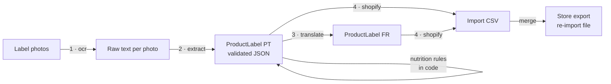

# label-extractor

**Photos of a food label → EU-compliant product data in Portuguese and French, ready to import into Shopify.**

Built for a French e-commerce shop selling imported Brazilian groceries. Every product sold in the EU
must show its legal name, ingredients, allergens, nutrition declaration, storage conditions and
responsible operator in the local language. The shop had hundreds of products whose only source
of truth was the physical package, often with labels in Portuguese, Spanish or Dutch, or a
handwritten sticker. This project turned "someone types every label by hand" into "take 1–4 photos,
review the result".

This repo is a cleaned-up, open version of that freelance work. It runs **fully locally on a
laptop CPU** (no API key, no GPU) with a small open vision model through
[Ollama](https://ollama.com), and switches to the **OpenAI API** with one setting.

<!-- RESULTS -->

## How it works



Each step is a small, separately testable **tool** in [`src/labelkit/tools/`](src/labelkit/tools):

| Tool | What it does | LLM? |
|---|---|---|
| `ocr.py` | Transcribes each photo (one image per call: small models do better). | vision |
| `extract.py` | Merges the transcriptions into a `ProductLabel` via **JSON-schema structured output**, validated with Pydantic and retried with the error on failure. | text |
| `nutrition.py` | Per-portion → per-100 g, sodium → salt (×2.5), and rendering of the EU nutrition block in each language. | **no, plain code** |
| `translate.py` | Translates the text fields; never lets the model fill a field that was empty. | text |
| `shopify.py` | Maps fields to Shopify metafield columns (configurable [YAML](src/labelkit/shopify_columns.yaml)) and merges them into a store product export. | no |
| `matching.py` | Matches messy supplier invoice lines to catalog products (used to import expiry dates): fuzzy retrieval with `rapidfuzz`, then LLM re-ranking only for uncertain cases. | optional |

### Design decisions

- **One client, two backends.** Ollama exposes an OpenAI-compatible API, so [`llm.py`](src/labelkit/llm.py)
  uses the official `openai` SDK for both and only the base URL changes. It's local by default and
  gpt-4o-mini when you need throughput.
- **Rules belong in code, not prompts.** The first version asked the model to convert units and
  compute salt from sodium. It sometimes did it wrong, and silently. Now the model only *copies*
  numbers, and the arithmetic is deterministic and unit-tested.
- **`null` instead of guesses.** The schema separates "not on the label" (`null`) from the
  per-language defaults ("Non spécifié", "Prêt à consommer"…), which are applied at export time.
  This makes hallucinations measurable.
- **Measured, not eyeballed.** [`samples/`](samples) has hand-checked `expected.json` files and
  `labelkit evaluate` reports per-field accuracy.
- **Cheap reruns.** Every LLM call is cached on disk by request hash, and finished products are
  skipped, so a batch that crashes halfway resumes where it stopped.

## Quick start

Requires [uv](https://docs.astral.sh/uv/) and either Docker or a local [Ollama](https://ollama.com/download).

```bash
git clone https://github.com/luiznery/label-extractor && cd label-extractor
uv sync

# Local model (CPU, ~3 GB download)
docker run -d --name ollama -p 11434:11434 -v ollama:/root/.ollama ollama/ollama
docker exec ollama ollama pull qwen2.5vl:3b

uv run labelkit run samples            # full pipeline on the 5 sample products
uv run labelkit evaluate               # accuracy vs. samples/*/expected.json
```

Using OpenAI instead:

```bash
cp .env.example .env    # then set LABELKIT_PROVIDER=openai and OPENAI_API_KEY=sk-...
uv run labelkit run samples --provider openai
```

Or run everything, demo included, with Docker: `docker compose up`, then open http://localhost:7860.

### CLI

```
labelkit ocr IMAGE                      transcribe one photo
labelkit run PATH                       OCR → extract → translate → output/shopify_import.csv
labelkit export [RESULTS_DIR]           rebuild the CSV from saved results (no LLM calls)
labelkit merge STORE_EXPORT [NEW_CSV]   merge into a store export, ready to re-import
labelkit match CATALOG QUERIES          match invoice lines to catalog products
labelkit evaluate [SAMPLES] [RESULTS]   per-field accuracy
```

A product is a folder of photos; the folder name is used as the product ID.

### Demo app

```bash
uv run --extra app python app/app.py
```

The **Examples** tab shows precomputed results for the samples instantly. **Try it** runs the
pipeline on your own photos with the local model or with your OpenAI key (used for that request
only, never stored).

## Development

```bash
uv run pytest          # LLM calls are faked: tests are fast and offline
uv run ruff check . && uv run ruff format --check .
```

## Lessons learned

From the original project:

1. **Photo quality beats prompt engineering.** A sharp photo, cropped to the label and without
   glare, does more for accuracy than any prompt change.
2. **Short prompts work better**, especially with small models.
3. **Keep the model's job narrow.** Read, copy and translate are reliable; arithmetic and
   "use this default unless…" logic belong in code.

## License

MIT for the code. The sample photos show commercial packaging and are included only to
demonstrate the pipeline.
