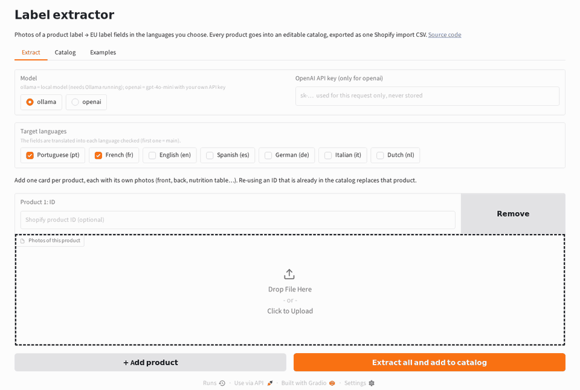
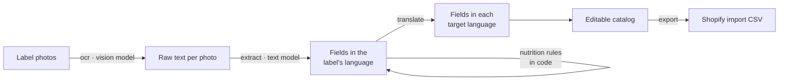

# Product Label Extractor: product photos to multilingual e-commerce data with local vision LLMs

**Photos of a food label → EU-compliant product data in the languages you choose (Portuguese, French, English, Spanish, German, Italian, Dutch), ready to import into Shopify.**



<sub>Demo with the local models; the extraction step is sped up (on a laptop CPU it takes about 1.5 min per photo).</sub>

Every food product sold in the EU must show its legal name, ingredients, allergens, nutrition
declaration, storage conditions and responsible operator in the local language. For an online shop
in France selling imported food, the only source for this was the physical package, with labels in
Portuguese, Spanish or Dutch, sometimes a handwritten sticker. This project turns "someone types every
label by hand" into **take a few photos, review, export**.

It is a cleaned-up, open version of freelance work. It runs **fully locally on a laptop CPU** (no
API key, no GPU) with small open models through [Ollama](https://ollama.com), and switches to the
**OpenAI API** with one setting.

## How it works



Each step is a small, separately testable tool in [`src/labelkit/tools/`](src/labelkit/tools):

| Tool | What it does | Model |
|---|---|---|
| `ocr.py` | Transcribes each photo, one image per call (small models do better that way). | vision |
| `extract.py` | Turns the transcriptions into a `ProductLabel` with **JSON-schema structured output**, validated with Pydantic and retried with the error message on failure. | text |
| `nutrition.py` | Per-portion → per-100 g, sodium → salt (×2.5), and the EU nutrition block in each language. | **none, plain code** |
| `translate.py` | Translates the text fields; never lets the model fill a field that was empty. | text |
| `shopify.py` | Maps fields to Shopify metafield columns ([configurable YAML](src/labelkit/shopify_columns.yaml)) and merges them into a store product export. | none |
| `matching.py` | Matches messy supplier invoice lines to catalog products (used to import expiry dates): fuzzy retrieval with `rapidfuzz`, LLM re-ranking only for uncertain matches. | optional |

### Design decisions

- **One client, two backends.** Ollama exposes an OpenAI-compatible API, so [`llm.py`](src/labelkit/llm.py)
  uses the official `openai` SDK for both; only the base URL changes.
- **Rules belong in code, not prompts.** The first version asked the model to convert units and
  compute salt from sodium; it sometimes got it wrong, silently. Now the model only *copies* numbers
  and the arithmetic is deterministic and unit-tested.
- **`null` instead of guesses.** The schema separates "not on the label" from the per-language
  defaults ("Non spécifié", "Prêt à consommer"…) applied at export, which makes hallucinations measurable.
- **Fail soft, never lose work.** Small models occasionally get stuck repeating themselves; output
  is capped so a loop fails in about a minute instead of hanging, invalid JSON is retried, and if a translation still fails the product is kept with its
  original text and flagged **⚠ Review** in the catalog.
- **Cheap reruns.** Every model call is cached on disk by request hash, and finished products are
  skipped, so an interrupted batch resumes where it stopped.

## Quick start

Requires [uv](https://docs.astral.sh/uv/) and Docker (or a local [Ollama](https://ollama.com/download)).

```bash
git clone https://github.com/luiznery/label-extractor && cd label-extractor
uv sync --extra app

# Local models (CPU only, ~5 GB download)
docker run -d --name ollama -p 11434:11434 -v ollama:/root/.ollama ollama/ollama
docker exec ollama ollama pull qwen2.5vl:3b
docker exec ollama ollama pull qwen2.5:3b

uv run --extra app python app/app.py   # web app on http://localhost:7860
```

Or everything in containers: `docker compose up` (first start downloads the models).

To use OpenAI instead, pick **openai** in the app and paste a key, or for the CLI:

```bash
cp .env.example .env    # set LABELKIT_PROVIDER=openai and OPENAI_API_KEY=sk-...
```

### The app

- **Extract**: choose the **target languages**, then add one card per product (**+ Add product**), each with its own ID and photos (front,
  back, nutrition table…). **Extract all** processes them one by one with live status; a failure
  doesn't stop the others and the failed card stays on the page to retry.
- **Catalog**: every extracted product accumulates here (saved in `output/catalog/`). Pick one, edit
  any field in any language in place, rename or delete it, then **Generate CSV** with all products.
- **Examples**: precomputed results for the sample labels, to try the catalog without waiting for a model.

### CLI

A product is a folder of photos; the folder name is the product ID.

```
labelkit run PATH [--languages pt,fr]   OCR → extract → translate → output/shopify_import.csv
labelkit ocr IMAGE                      transcribe one photo
labelkit export [RESULTS_DIR]           rebuild the CSV from saved results (no model calls)
labelkit merge STORE_EXPORT [NEW_CSV]   merge into a store product export, ready to re-import
labelkit match CATALOG QUERIES          match invoice lines to catalog products
labelkit evaluate [SAMPLES] [RESULTS]   per-field accuracy against expected.json files
```

### Configuration

All settings are environment variables (or a `.env` file), see [`.env.example`](.env.example):
provider, base URL, models, target languages, `LABELKIT_REASONING_EFFORT=none` for "thinking"
models such as qwen3.

**Target languages.** Supported: `pt`, `fr`, `en`, `es`, `de`, `it`, `nl` (default `pt,fr`; the
first one is the main language). The model translates the label text, while the fixed parts (the
EU nutrition declaration, defaults such as "not specified") are written by hand in
[`i18n.py`](src/labelkit/i18n.py) so they always use the regulation's wording. Adding a language
means adding its strings there.
For hosting the app publicly, `LABELKIT_CATALOG_DIR=""` keeps each visitor's catalog in their
session only (nothing written to disk) and `LABELKIT_APP_PROVIDERS=openai` hides the local-model option.
[`deploy/build_space.sh`](deploy/build_space.sh) packages the app as a Hugging Face Space (Gradio SDK).

### Better results with larger models

The defaults are the smallest models that run comfortably on a laptop CPU, chosen so the project
works anywhere without a GPU or an API key. **For better results, use larger models**: for example
`qwen2.5vl:7b` (or bigger) to read the photos and `qwen2.5:7b` (or bigger) for extraction and
translation if you have a GPU or more memory, or the OpenAI provider. No code change is needed:

```bash
docker exec ollama ollama pull qwen2.5vl:7b
LABELKIT_VISION_MODEL=qwen2.5vl:7b LABELKIT_TEXT_MODEL=qwen2.5:7b uv run labelkit run samples
uv run labelkit evaluate   # compare against the hand-checked samples
```

## Next steps

- **Android application.** Photographing labels is naturally a phone task: the app would let you
  create a product, take its photos with the camera, send them for extraction, review and edit the
  fields on the phone, and sync the catalog. The pipeline would be exposed as a small HTTP API that
  the app calls, running on a local machine with the open models or in the cloud with a hosted one.

## Development

```bash
uv run pytest          # model calls are faked: fast and offline
uv run ruff check . && uv run ruff format --check .
```

## License

MIT for the code. The sample photos show commercial packaging and are included only to demonstrate
the pipeline.
